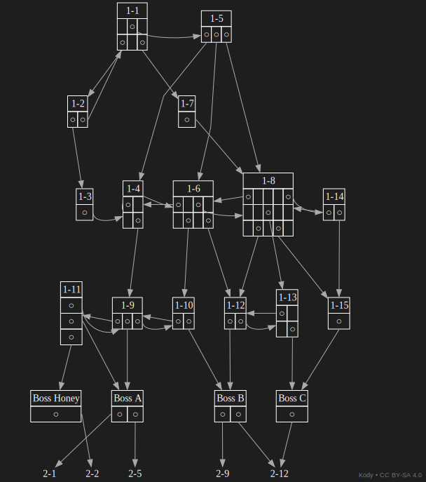
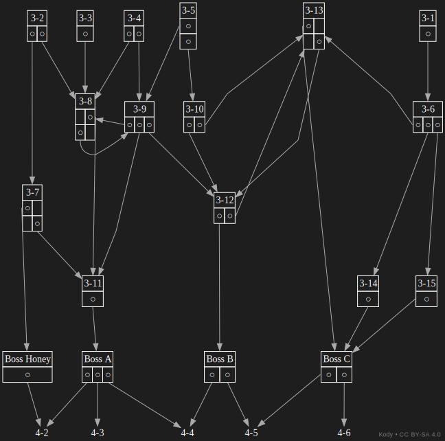

# superbomberman5-stage-tree
Graphviz stage progression graph for Super Bomberman 5 (Normal Mode).

This map visualizes the branching stage structure of the game.

## Contents
  - [Disclaimer](#disclaimer)
  - [Map](#map)
  - [Download](#download)

## Disclaimer
**Game assets belong to their respective owners.**
**This repository contains only original guide information.**

## Map

## Download
📥 **Download full image**

| Zone | PNG | SVG |
|------|------|--|
| Zone 1 | [Download](assets/png/zone1.png) | [Download](assets/svg/zone1.svg) |
| Zone 2 | [Download](assets/png/zone2.png) | [Download](assets/svg/zone2.svg) |
| Zone 3 | [Download](assets/png/zone3.png) | [Download](assets/svg/zone3.svg) |
| Zone 4 | [Download](assets/png/zone4.png) | [Download](assets/svg/zone4.svg) |
| Zone 5 | [Download](assets/png/zone5.png) | [Download](assets/svg/zone5.svg) |

